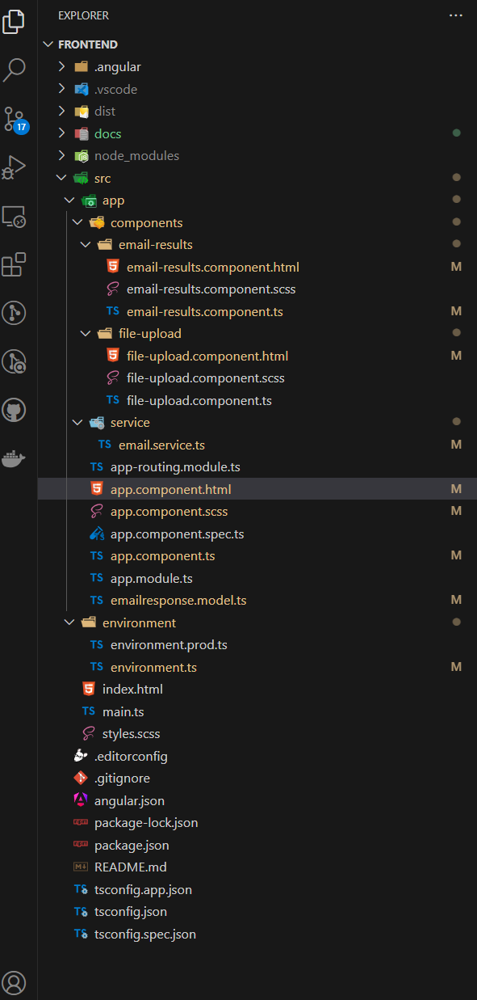

# 🚀Email Classification & Data Extraction Application

## 📌 Table of Contents
- [Introduction](#introduction)
- [Demo](#demo)
- [Inspiration](#inspiration)
- [What It Does](#what-it-does)
- [How We Built It](#how-we-built-it)
- [Challenges We Faced](#challenges-we-faced)
- [How to Run](#how-to-run)
- [Tech Stack](#tech-stack)
- [Team](#team)

---

## 🎯 Introduction
This application provides a streamlined solution for managing and understanding email data. It allows users to classify emails and extract relevant information through two primary methods: uploading email files directly or processing emails located in a pre-configured server directory. The results of the classification are displayed in an easy-to-read grid format.

---

## Getting Started
## 🎥 Demo
🔗 [Live Demo](#) (if applicable)  
📹 [Clieck me for Video Demo](https://drive.google.com/file/d/1xkrMITqHK2_loJ2AMb7FmfDHPI5fhmij/view?usp=drive_link) (if applicable)  

---
## API Server Url

 Now, we can test the Email Processing API, which is deployed at the following link: 
[https://vivek0912-genaiemailclassification.hf.space/docs]

---

## 🖼️ Test Artifacts Screenshots:





---

## 💡 Inspiration
What inspired you to create this project? Describe the problem you're solving.

---
## ⚙️ What It Does
* **Email File Upload:** Users can upload one or more email files (supporting `.eml`, `.msg`, `.txt` formats) directly through the web interface for immediate processing and classification.
* **Directory Processing:** The application can be configured to automatically process all email files within a specific server directory. This feature is ideal for handling large volumes of emails or for automated background processing.
* **Intelligent Classification:** Utilizes advanced models (potentially leveraging Gemini AI as indicated in the code) to categorize emails based on their content, subject, and attachments.
* **Data Extraction:** Extracts key information from emails, including sender, subject, and potentially other relevant data points.
* **Confidence Scoring:** Provides a confidence score for each classification, indicating the reliability of the prediction.
* **Duplicate Detection:** Identifies and flags potential duplicate emails based on their content.
* **Clear Results Display:** Presents the classification results in a user-friendly grid table, showing key information like sender, subject, predicted request type, sub-request type, confidence score, and duplicate status.
* **Loading Indicator:** Provides visual feedback during the email processing to keep users informed of the application's status.

---
## 🛠️ How We Built It
Briefly outline the technologies, frameworks, and tools used in development.
- 🔹 Frontend: Angular
- 🔹 Backend:  FastAPI / 
- 🔹 Database: PostgreSQL / Firebase
- 🔹 Other: GEMINI
- 🔹 Uvicorn: (ASGI Server)
- 🔹 Scikit-learn & Pandas: (Data Processing)

---
## 🚧 Challenges We Faced
🔹 Technical Challenges
1️⃣ API Rate Limits & Quotas
Issue: The Google Gemini API has request rate limits, restricting the number of emails processed per minute.

Solution: Implemented batch processing and cached responses to minimize API calls.

2️⃣ Handling Long Emails (Token Limit)
Issue: Gemini models have input token limits, causing issues with long emails.

Solution: Used text summarization before classification to reduce input size.

3️⃣ Model Output Variability
Issue: Gemini sometimes generates inconsistent or ambiguous classifications.

Solution: Used structured prompting and few-shot learning to improve reliability.

4️⃣ Latency in Real-Time Classification
Issue: API-based models introduce a delay in processing, especially for bulk emails.

Solution: Optimized request handling and considered local inference with Gemini Nano.

5️⃣ Security & Compliance
Issue: Sending email data to a cloud-based API raised privacy concerns.

Solution: Used data anonymization before processing emails.

🔹 Non-Technical Challenges
1️⃣ Understanding Business Requirements
Issue: Stakeholders had different expectations for email classification categories.

Solution: Conducted requirement workshops to finalize label categories (Spam, Urgent, Business, Phishing, etc.).

2️⃣ User Trust in AI Predictions
Issue: Some users doubted the accuracy of AI-based classification.

Solution: Provided explainability by adding confidence scores in responses.

3️⃣ Cost Management
Issue: The Gemini API incurs costs per request, making scalability expensive.

Solution: Implemented hybrid models (smaller local models + Gemini API for complex cases).

---
## BACKEND API
## 🏃 How to Run Backend code
1. Clone the repository  
   ```sh
   git clone https://github.com/your-username/gen_ai_email_processing.git](https://github.com/ewfx/gaied-insight-masters.git)
   cd gaied-insight-masters\code\backend
   ```
2. Create a Virtual Environment
 ```sh
   python -m venv backend_env
   backend_env\Scripts\activate    # On Windows
  ```
4. Install dependencies  
   ```sh
   pip install --upgrade pip
   pip install -r requirements.txt
   ```
5. Run the project  
   ```sh
   uvicorn app.main:app --host 0.0.0.0 --port 8000 --reload
   ```
6. Access the API Documentation
    ```sh
     Open Swagger UI: [http://127.0.0.1:8000/docs]
   ```
## 📬 API Endpoints
| Method |     Endpoint              | Description              |
|--------|---------------------------|--------------------------|
| POST   | `/process-emails-uploadl` | Upload and process email |
| GET    | `/process-email-directory`| process email on go      |

## 🏗️ Tech Stack
- 🔹 Frontend: Angular
- 🔹 Backend:  FastAPI / 
- 🔹 Database: PostgreSQL / Firebase
- 🔹 Other: GEMINI
- 🔹 Uvicorn: (ASGI Server)
- 🔹 Scikit-learn & Pandas: (Data Processing)
## 🛠 Environment Variables
Create a `.env` file in the **config/** directory and add the necessary settings:
```ini
MODEL_PATH=gemini-2.0-flash-lite
```
---

## 🔄 Updating the Project
If you pull new changes from GitHub, remember to update dependencies:
```sh
 git pull origin main
 pip install -r requirements.txt
```
---
## 📤 Pushing the Project to GitHub
After making changes, push them to GitHub:
```sh
 git add .
 git commit -m "Updated project files"
 git push origin main
```
---
### Frontend UI(Angular)
1. Clone the repository  
   ```sh
   git clone https://github.com/your-username/gen_ai_email_processing.git](https://github.com/ewfx/gaied-insight-masters.git)
   cd gaied-insight-masters\code\frontend
   ```
2. Install dependencies  
   ```sh
   npm install
   ```
3. Run the project  
   ```sh
   ng serve/npm start
   ```
4. Access the API Documentation
    ```sh
     Open UI: [http://localhost:4200/]
   ```

---
## 👥 Team
- **Vivek Vishal** - [GitHub](#) | [LinkedIn](#)
- **Dharmendar Potlaplli** - [GitHub](#) | [LinkedIn](#)
